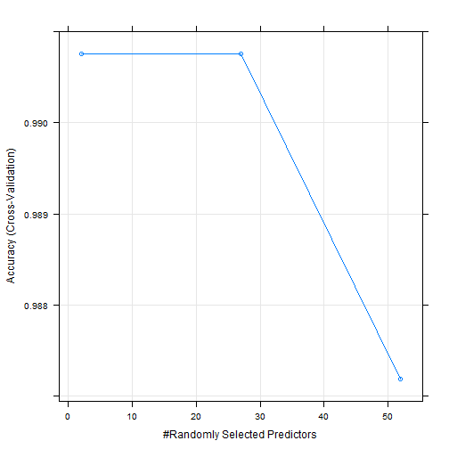
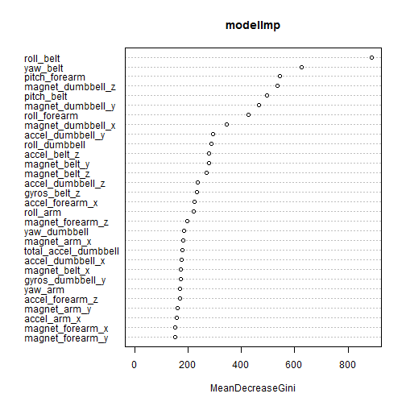
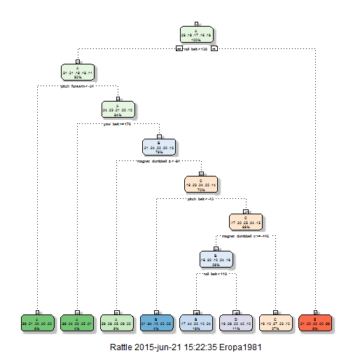

### Background

Using devices such as Jawbone Up, Nike FuelBand, and Fitbit it is now possible to collect a large amount of data about personal activity relatively inexpensively. These type of devices are part of the quantified self movement - a group of enthusiasts who take measurements about themselves regularly to improve their health, to find patterns in their behavior, or because they are tech geeks. One thing that people regularly do is quantify how much of a particular activity they do, but they rarely quantify how well they do it. In this project, your goal will be to use data from accelerometers on the belt, forearm, arm, and dumbell of 6 participants. They were asked to perform barbell lifts correctly and incorrectly in 5 different ways. More information is available from the website here: http://groupware.les.inf.puc-rio.br/har (see the section on the Weight Lifting Exercise Dataset). 


### Reading and Manipulating Data

#### Load needed Packages 

The first step is call the different librarys that we going to use


```r
suppressWarnings(suppressMessages(library(caret)))
suppressWarnings(suppressMessages(library(rpart)))
suppressWarnings(suppressMessages(library(rpart.plot)))
suppressWarnings(suppressMessages(library(randomForest)))
suppressWarnings(suppressMessages(library(rattle)))
```


#### Set working directory and files to work

Next, is necessary to define the working directory


```r
Dir<-setwd("C:/Users/Eropa1981/Desktop/MachineLearning")
testDB <- "https://d396qusza40orc.cloudfront.net/predmachlearn/pml-testing.csv"
trainDB <-"https://d396qusza40orc.cloudfront.net/predmachlearn/pml-training.csv"

testCsv  <- "./pml-testing.csv"
trainCsv <- "./pml-training.csv"
```


#### Download Training and testing files to Directory

Next, We need obtain data to work, in possible to create a function to conditional downloading


```r
if (!file.exists(testCsv)) {
  download.file(testDB, destfile=testCsv)
}

if (!file.exists(trainCsv)) {
  download.file(trainDB, destfile=trainCsv)
}
getwd()
```

```
## [1] "C:/Users/Eropa1981/Desktop/MachineLearning"
```

```r
dir(Dir)
```

```
##  [1] "Eropa1981_Assignment.Rmd" "pml-testing.csv"         
##  [3] "pml-training.csv"         "problem_id_1.txt"        
##  [5] "problem_id_10.txt"        "problem_id_11.txt"       
##  [7] "problem_id_12.txt"        "problem_id_13.txt"       
##  [9] "problem_id_14.txt"        "problem_id_15.txt"       
## [11] "problem_id_16.txt"        "problem_id_17.txt"       
## [13] "problem_id_18.txt"        "problem_id_19.txt"       
## [15] "problem_id_2.txt"         "problem_id_20.txt"       
## [17] "problem_id_3.txt"         "problem_id_4.txt"        
## [19] "problem_id_5.txt"         "problem_id_6.txt"        
## [21] "problem_id_7.txt"         "problem_id_8.txt"        
## [23] "problem_id_9.txt"
```


#### Reading the CSV Files to R

To continue is necessary to load data from CSV Files to data frames in R, at this point we can make a look to data quality.


```r
train <- read.csv("./pml-training.csv")
test <- read.csv("./pml-testing.csv")
dim(train)
```

```
## [1] 19622   160
```

```r
dim(test)
```

```
## [1]  20 160
```

```r
str(train)
```

```
## 'data.frame':	19622 obs. of  160 variables:
##  $ X                       : int  1 2 3 4 5 6 7 8 9 10 ...
##  $ user_name               : Factor w/ 6 levels "adelmo","carlitos",..: 2 2 2 2 2 2 2 2 2 2 ...
##  $ raw_timestamp_part_1    : int  1323084231 1323084231 1323084231 1323084232 1323084232 1323084232 1323084232 1323084232 1323084232 1323084232 ...
##  $ raw_timestamp_part_2    : int  788290 808298 820366 120339 196328 304277 368296 440390 484323 484434 ...
##  $ cvtd_timestamp          : Factor w/ 20 levels "02/12/2011 13:32",..: 9 9 9 9 9 9 9 9 9 9 ...
##  $ new_window              : Factor w/ 2 levels "no","yes": 1 1 1 1 1 1 1 1 1 1 ...
##  $ num_window              : int  11 11 11 12 12 12 12 12 12 12 ...
##  $ roll_belt               : num  1.41 1.41 1.42 1.48 1.48 1.45 1.42 1.42 1.43 1.45 ...
##  $ pitch_belt              : num  8.07 8.07 8.07 8.05 8.07 8.06 8.09 8.13 8.16 8.17 ...
##  $ yaw_belt                : num  -94.4 -94.4 -94.4 -94.4 -94.4 -94.4 -94.4 -94.4 -94.4 -94.4 ...
##  $ total_accel_belt        : int  3 3 3 3 3 3 3 3 3 3 ...
##  $ kurtosis_roll_belt      : Factor w/ 397 levels "","-0.016850",..: 1 1 1 1 1 1 1 1 1 1 ...
##  $ kurtosis_picth_belt     : Factor w/ 317 levels "","-0.021887",..: 1 1 1 1 1 1 1 1 1 1 ...
##  $ kurtosis_yaw_belt       : Factor w/ 2 levels "","#DIV/0!": 1 1 1 1 1 1 1 1 1 1 ...
##  $ skewness_roll_belt      : Factor w/ 395 levels "","-0.003095",..: 1 1 1 1 1 1 1 1 1 1 ...
##  $ skewness_roll_belt.1    : Factor w/ 338 levels "","-0.005928",..: 1 1 1 1 1 1 1 1 1 1 ...
##  $ skewness_yaw_belt       : Factor w/ 2 levels "","#DIV/0!": 1 1 1 1 1 1 1 1 1 1 ...
##  $ max_roll_belt           : num  NA NA NA NA NA NA NA NA NA NA ...
##  $ max_picth_belt          : int  NA NA NA NA NA NA NA NA NA NA ...
##  $ max_yaw_belt            : Factor w/ 68 levels "","-0.1","-0.2",..: 1 1 1 1 1 1 1 1 1 1 ...
##  $ min_roll_belt           : num  NA NA NA NA NA NA NA NA NA NA ...
##  $ min_pitch_belt          : int  NA NA NA NA NA NA NA NA NA NA ...
##  $ min_yaw_belt            : Factor w/ 68 levels "","-0.1","-0.2",..: 1 1 1 1 1 1 1 1 1 1 ...
##  $ amplitude_roll_belt     : num  NA NA NA NA NA NA NA NA NA NA ...
##  $ amplitude_pitch_belt    : int  NA NA NA NA NA NA NA NA NA NA ...
##  $ amplitude_yaw_belt      : Factor w/ 4 levels "","#DIV/0!","0.00",..: 1 1 1 1 1 1 1 1 1 1 ...
##  $ var_total_accel_belt    : num  NA NA NA NA NA NA NA NA NA NA ...
##  $ avg_roll_belt           : num  NA NA NA NA NA NA NA NA NA NA ...
##  $ stddev_roll_belt        : num  NA NA NA NA NA NA NA NA NA NA ...
##  $ var_roll_belt           : num  NA NA NA NA NA NA NA NA NA NA ...
##  $ avg_pitch_belt          : num  NA NA NA NA NA NA NA NA NA NA ...
##  $ stddev_pitch_belt       : num  NA NA NA NA NA NA NA NA NA NA ...
##  $ var_pitch_belt          : num  NA NA NA NA NA NA NA NA NA NA ...
##  $ avg_yaw_belt            : num  NA NA NA NA NA NA NA NA NA NA ...
##  $ stddev_yaw_belt         : num  NA NA NA NA NA NA NA NA NA NA ...
##  $ var_yaw_belt            : num  NA NA NA NA NA NA NA NA NA NA ...
##  $ gyros_belt_x            : num  0 0.02 0 0.02 0.02 0.02 0.02 0.02 0.02 0.03 ...
##  $ gyros_belt_y            : num  0 0 0 0 0.02 0 0 0 0 0 ...
##  $ gyros_belt_z            : num  -0.02 -0.02 -0.02 -0.03 -0.02 -0.02 -0.02 -0.02 -0.02 0 ...
##  $ accel_belt_x            : int  -21 -22 -20 -22 -21 -21 -22 -22 -20 -21 ...
##  $ accel_belt_y            : int  4 4 5 3 2 4 3 4 2 4 ...
##  $ accel_belt_z            : int  22 22 23 21 24 21 21 21 24 22 ...
##  $ magnet_belt_x           : int  -3 -7 -2 -6 -6 0 -4 -2 1 -3 ...
##  $ magnet_belt_y           : int  599 608 600 604 600 603 599 603 602 609 ...
##  $ magnet_belt_z           : int  -313 -311 -305 -310 -302 -312 -311 -313 -312 -308 ...
##  $ roll_arm                : num  -128 -128 -128 -128 -128 -128 -128 -128 -128 -128 ...
##  $ pitch_arm               : num  22.5 22.5 22.5 22.1 22.1 22 21.9 21.8 21.7 21.6 ...
##  $ yaw_arm                 : num  -161 -161 -161 -161 -161 -161 -161 -161 -161 -161 ...
##  $ total_accel_arm         : int  34 34 34 34 34 34 34 34 34 34 ...
##  $ var_accel_arm           : num  NA NA NA NA NA NA NA NA NA NA ...
##  $ avg_roll_arm            : num  NA NA NA NA NA NA NA NA NA NA ...
##  $ stddev_roll_arm         : num  NA NA NA NA NA NA NA NA NA NA ...
##  $ var_roll_arm            : num  NA NA NA NA NA NA NA NA NA NA ...
##  $ avg_pitch_arm           : num  NA NA NA NA NA NA NA NA NA NA ...
##  $ stddev_pitch_arm        : num  NA NA NA NA NA NA NA NA NA NA ...
##  $ var_pitch_arm           : num  NA NA NA NA NA NA NA NA NA NA ...
##  $ avg_yaw_arm             : num  NA NA NA NA NA NA NA NA NA NA ...
##  $ stddev_yaw_arm          : num  NA NA NA NA NA NA NA NA NA NA ...
##  $ var_yaw_arm             : num  NA NA NA NA NA NA NA NA NA NA ...
##  $ gyros_arm_x             : num  0 0.02 0.02 0.02 0 0.02 0 0.02 0.02 0.02 ...
##  $ gyros_arm_y             : num  0 -0.02 -0.02 -0.03 -0.03 -0.03 -0.03 -0.02 -0.03 -0.03 ...
##  $ gyros_arm_z             : num  -0.02 -0.02 -0.02 0.02 0 0 0 0 -0.02 -0.02 ...
##  $ accel_arm_x             : int  -288 -290 -289 -289 -289 -289 -289 -289 -288 -288 ...
##  $ accel_arm_y             : int  109 110 110 111 111 111 111 111 109 110 ...
##  $ accel_arm_z             : int  -123 -125 -126 -123 -123 -122 -125 -124 -122 -124 ...
##  $ magnet_arm_x            : int  -368 -369 -368 -372 -374 -369 -373 -372 -369 -376 ...
##  $ magnet_arm_y            : int  337 337 344 344 337 342 336 338 341 334 ...
##  $ magnet_arm_z            : int  516 513 513 512 506 513 509 510 518 516 ...
##  $ kurtosis_roll_arm       : Factor w/ 330 levels "","-0.02438",..: 1 1 1 1 1 1 1 1 1 1 ...
##  $ kurtosis_picth_arm      : Factor w/ 328 levels "","-0.00484",..: 1 1 1 1 1 1 1 1 1 1 ...
##  $ kurtosis_yaw_arm        : Factor w/ 395 levels "","-0.01548",..: 1 1 1 1 1 1 1 1 1 1 ...
##  $ skewness_roll_arm       : Factor w/ 331 levels "","-0.00051",..: 1 1 1 1 1 1 1 1 1 1 ...
##  $ skewness_pitch_arm      : Factor w/ 328 levels "","-0.00184",..: 1 1 1 1 1 1 1 1 1 1 ...
##  $ skewness_yaw_arm        : Factor w/ 395 levels "","-0.00311",..: 1 1 1 1 1 1 1 1 1 1 ...
##  $ max_roll_arm            : num  NA NA NA NA NA NA NA NA NA NA ...
##  $ max_picth_arm           : num  NA NA NA NA NA NA NA NA NA NA ...
##  $ max_yaw_arm             : int  NA NA NA NA NA NA NA NA NA NA ...
##  $ min_roll_arm            : num  NA NA NA NA NA NA NA NA NA NA ...
##  $ min_pitch_arm           : num  NA NA NA NA NA NA NA NA NA NA ...
##  $ min_yaw_arm             : int  NA NA NA NA NA NA NA NA NA NA ...
##  $ amplitude_roll_arm      : num  NA NA NA NA NA NA NA NA NA NA ...
##  $ amplitude_pitch_arm     : num  NA NA NA NA NA NA NA NA NA NA ...
##  $ amplitude_yaw_arm       : int  NA NA NA NA NA NA NA NA NA NA ...
##  $ roll_dumbbell           : num  13.1 13.1 12.9 13.4 13.4 ...
##  $ pitch_dumbbell          : num  -70.5 -70.6 -70.3 -70.4 -70.4 ...
##  $ yaw_dumbbell            : num  -84.9 -84.7 -85.1 -84.9 -84.9 ...
##  $ kurtosis_roll_dumbbell  : Factor w/ 398 levels "","-0.0035","-0.0073",..: 1 1 1 1 1 1 1 1 1 1 ...
##  $ kurtosis_picth_dumbbell : Factor w/ 401 levels "","-0.0163","-0.0233",..: 1 1 1 1 1 1 1 1 1 1 ...
##  $ kurtosis_yaw_dumbbell   : Factor w/ 2 levels "","#DIV/0!": 1 1 1 1 1 1 1 1 1 1 ...
##  $ skewness_roll_dumbbell  : Factor w/ 401 levels "","-0.0082","-0.0096",..: 1 1 1 1 1 1 1 1 1 1 ...
##  $ skewness_pitch_dumbbell : Factor w/ 402 levels "","-0.0053","-0.0084",..: 1 1 1 1 1 1 1 1 1 1 ...
##  $ skewness_yaw_dumbbell   : Factor w/ 2 levels "","#DIV/0!": 1 1 1 1 1 1 1 1 1 1 ...
##  $ max_roll_dumbbell       : num  NA NA NA NA NA NA NA NA NA NA ...
##  $ max_picth_dumbbell      : num  NA NA NA NA NA NA NA NA NA NA ...
##  $ max_yaw_dumbbell        : Factor w/ 73 levels "","-0.1","-0.2",..: 1 1 1 1 1 1 1 1 1 1 ...
##  $ min_roll_dumbbell       : num  NA NA NA NA NA NA NA NA NA NA ...
##  $ min_pitch_dumbbell      : num  NA NA NA NA NA NA NA NA NA NA ...
##  $ min_yaw_dumbbell        : Factor w/ 73 levels "","-0.1","-0.2",..: 1 1 1 1 1 1 1 1 1 1 ...
##  $ amplitude_roll_dumbbell : num  NA NA NA NA NA NA NA NA NA NA ...
##   [list output truncated]
```

```r
head(train)
```

```
##   X user_name raw_timestamp_part_1 raw_timestamp_part_2   cvtd_timestamp
## 1 1  carlitos           1323084231               788290 05/12/2011 11:23
## 2 2  carlitos           1323084231               808298 05/12/2011 11:23
## 3 3  carlitos           1323084231               820366 05/12/2011 11:23
## 4 4  carlitos           1323084232               120339 05/12/2011 11:23
## 5 5  carlitos           1323084232               196328 05/12/2011 11:23
## 6 6  carlitos           1323084232               304277 05/12/2011 11:23
##   new_window num_window roll_belt pitch_belt yaw_belt total_accel_belt
## 1         no         11      1.41       8.07    -94.4                3
## 2         no         11      1.41       8.07    -94.4                3
## 3         no         11      1.42       8.07    -94.4                3
## 4         no         12      1.48       8.05    -94.4                3
## 5         no         12      1.48       8.07    -94.4                3
## 6         no         12      1.45       8.06    -94.4                3
##   kurtosis_roll_belt kurtosis_picth_belt kurtosis_yaw_belt
## 1                                                         
## 2                                                         
## 3                                                         
## 4                                                         
## 5                                                         
## 6                                                         
##   skewness_roll_belt skewness_roll_belt.1 skewness_yaw_belt max_roll_belt
## 1                                                                      NA
## 2                                                                      NA
## 3                                                                      NA
## 4                                                                      NA
## 5                                                                      NA
## 6                                                                      NA
##   max_picth_belt max_yaw_belt min_roll_belt min_pitch_belt min_yaw_belt
## 1             NA                         NA             NA             
## 2             NA                         NA             NA             
## 3             NA                         NA             NA             
## 4             NA                         NA             NA             
## 5             NA                         NA             NA             
## 6             NA                         NA             NA             
##   amplitude_roll_belt amplitude_pitch_belt amplitude_yaw_belt
## 1                  NA                   NA                   
## 2                  NA                   NA                   
## 3                  NA                   NA                   
## 4                  NA                   NA                   
## 5                  NA                   NA                   
## 6                  NA                   NA                   
##   var_total_accel_belt avg_roll_belt stddev_roll_belt var_roll_belt
## 1                   NA            NA               NA            NA
## 2                   NA            NA               NA            NA
## 3                   NA            NA               NA            NA
## 4                   NA            NA               NA            NA
## 5                   NA            NA               NA            NA
## 6                   NA            NA               NA            NA
##   avg_pitch_belt stddev_pitch_belt var_pitch_belt avg_yaw_belt
## 1             NA                NA             NA           NA
## 2             NA                NA             NA           NA
## 3             NA                NA             NA           NA
## 4             NA                NA             NA           NA
## 5             NA                NA             NA           NA
## 6             NA                NA             NA           NA
##   stddev_yaw_belt var_yaw_belt gyros_belt_x gyros_belt_y gyros_belt_z
## 1              NA           NA         0.00         0.00        -0.02
## 2              NA           NA         0.02         0.00        -0.02
## 3              NA           NA         0.00         0.00        -0.02
## 4              NA           NA         0.02         0.00        -0.03
## 5              NA           NA         0.02         0.02        -0.02
## 6              NA           NA         0.02         0.00        -0.02
##   accel_belt_x accel_belt_y accel_belt_z magnet_belt_x magnet_belt_y
## 1          -21            4           22            -3           599
## 2          -22            4           22            -7           608
## 3          -20            5           23            -2           600
## 4          -22            3           21            -6           604
## 5          -21            2           24            -6           600
## 6          -21            4           21             0           603
##   magnet_belt_z roll_arm pitch_arm yaw_arm total_accel_arm var_accel_arm
## 1          -313     -128      22.5    -161              34            NA
## 2          -311     -128      22.5    -161              34            NA
## 3          -305     -128      22.5    -161              34            NA
## 4          -310     -128      22.1    -161              34            NA
## 5          -302     -128      22.1    -161              34            NA
## 6          -312     -128      22.0    -161              34            NA
##   avg_roll_arm stddev_roll_arm var_roll_arm avg_pitch_arm stddev_pitch_arm
## 1           NA              NA           NA            NA               NA
## 2           NA              NA           NA            NA               NA
## 3           NA              NA           NA            NA               NA
## 4           NA              NA           NA            NA               NA
## 5           NA              NA           NA            NA               NA
## 6           NA              NA           NA            NA               NA
##   var_pitch_arm avg_yaw_arm stddev_yaw_arm var_yaw_arm gyros_arm_x
## 1            NA          NA             NA          NA        0.00
## 2            NA          NA             NA          NA        0.02
## 3            NA          NA             NA          NA        0.02
## 4            NA          NA             NA          NA        0.02
## 5            NA          NA             NA          NA        0.00
## 6            NA          NA             NA          NA        0.02
##   gyros_arm_y gyros_arm_z accel_arm_x accel_arm_y accel_arm_z magnet_arm_x
## 1        0.00       -0.02        -288         109        -123         -368
## 2       -0.02       -0.02        -290         110        -125         -369
## 3       -0.02       -0.02        -289         110        -126         -368
## 4       -0.03        0.02        -289         111        -123         -372
## 5       -0.03        0.00        -289         111        -123         -374
## 6       -0.03        0.00        -289         111        -122         -369
##   magnet_arm_y magnet_arm_z kurtosis_roll_arm kurtosis_picth_arm
## 1          337          516                                     
## 2          337          513                                     
## 3          344          513                                     
## 4          344          512                                     
## 5          337          506                                     
## 6          342          513                                     
##   kurtosis_yaw_arm skewness_roll_arm skewness_pitch_arm skewness_yaw_arm
## 1                                                                       
## 2                                                                       
## 3                                                                       
## 4                                                                       
## 5                                                                       
## 6                                                                       
##   max_roll_arm max_picth_arm max_yaw_arm min_roll_arm min_pitch_arm
## 1           NA            NA          NA           NA            NA
## 2           NA            NA          NA           NA            NA
## 3           NA            NA          NA           NA            NA
## 4           NA            NA          NA           NA            NA
## 5           NA            NA          NA           NA            NA
## 6           NA            NA          NA           NA            NA
##   min_yaw_arm amplitude_roll_arm amplitude_pitch_arm amplitude_yaw_arm
## 1          NA                 NA                  NA                NA
## 2          NA                 NA                  NA                NA
## 3          NA                 NA                  NA                NA
## 4          NA                 NA                  NA                NA
## 5          NA                 NA                  NA                NA
## 6          NA                 NA                  NA                NA
##   roll_dumbbell pitch_dumbbell yaw_dumbbell kurtosis_roll_dumbbell
## 1      13.05217      -70.49400    -84.87394                       
## 2      13.13074      -70.63751    -84.71065                       
## 3      12.85075      -70.27812    -85.14078                       
## 4      13.43120      -70.39379    -84.87363                       
## 5      13.37872      -70.42856    -84.85306                       
## 6      13.38246      -70.81759    -84.46500                       
##   kurtosis_picth_dumbbell kurtosis_yaw_dumbbell skewness_roll_dumbbell
## 1                                                                     
## 2                                                                     
## 3                                                                     
## 4                                                                     
## 5                                                                     
## 6                                                                     
##   skewness_pitch_dumbbell skewness_yaw_dumbbell max_roll_dumbbell
## 1                                                              NA
## 2                                                              NA
## 3                                                              NA
## 4                                                              NA
## 5                                                              NA
## 6                                                              NA
##   max_picth_dumbbell max_yaw_dumbbell min_roll_dumbbell min_pitch_dumbbell
## 1                 NA                                 NA                 NA
## 2                 NA                                 NA                 NA
## 3                 NA                                 NA                 NA
## 4                 NA                                 NA                 NA
## 5                 NA                                 NA                 NA
## 6                 NA                                 NA                 NA
##   min_yaw_dumbbell amplitude_roll_dumbbell amplitude_pitch_dumbbell
## 1                                       NA                       NA
## 2                                       NA                       NA
## 3                                       NA                       NA
## 4                                       NA                       NA
## 5                                       NA                       NA
## 6                                       NA                       NA
##   amplitude_yaw_dumbbell total_accel_dumbbell var_accel_dumbbell
## 1                                          37                 NA
## 2                                          37                 NA
## 3                                          37                 NA
## 4                                          37                 NA
## 5                                          37                 NA
## 6                                          37                 NA
##   avg_roll_dumbbell stddev_roll_dumbbell var_roll_dumbbell
## 1                NA                   NA                NA
## 2                NA                   NA                NA
## 3                NA                   NA                NA
## 4                NA                   NA                NA
## 5                NA                   NA                NA
## 6                NA                   NA                NA
##   avg_pitch_dumbbell stddev_pitch_dumbbell var_pitch_dumbbell
## 1                 NA                    NA                 NA
## 2                 NA                    NA                 NA
## 3                 NA                    NA                 NA
## 4                 NA                    NA                 NA
## 5                 NA                    NA                 NA
## 6                 NA                    NA                 NA
##   avg_yaw_dumbbell stddev_yaw_dumbbell var_yaw_dumbbell gyros_dumbbell_x
## 1               NA                  NA               NA                0
## 2               NA                  NA               NA                0
## 3               NA                  NA               NA                0
## 4               NA                  NA               NA                0
## 5               NA                  NA               NA                0
## 6               NA                  NA               NA                0
##   gyros_dumbbell_y gyros_dumbbell_z accel_dumbbell_x accel_dumbbell_y
## 1            -0.02             0.00             -234               47
## 2            -0.02             0.00             -233               47
## 3            -0.02             0.00             -232               46
## 4            -0.02            -0.02             -232               48
## 5            -0.02             0.00             -233               48
## 6            -0.02             0.00             -234               48
##   accel_dumbbell_z magnet_dumbbell_x magnet_dumbbell_y magnet_dumbbell_z
## 1             -271              -559               293               -65
## 2             -269              -555               296               -64
## 3             -270              -561               298               -63
## 4             -269              -552               303               -60
## 5             -270              -554               292               -68
## 6             -269              -558               294               -66
##   roll_forearm pitch_forearm yaw_forearm kurtosis_roll_forearm
## 1         28.4         -63.9        -153                      
## 2         28.3         -63.9        -153                      
## 3         28.3         -63.9        -152                      
## 4         28.1         -63.9        -152                      
## 5         28.0         -63.9        -152                      
## 6         27.9         -63.9        -152                      
##   kurtosis_picth_forearm kurtosis_yaw_forearm skewness_roll_forearm
## 1                                                                  
## 2                                                                  
## 3                                                                  
## 4                                                                  
## 5                                                                  
## 6                                                                  
##   skewness_pitch_forearm skewness_yaw_forearm max_roll_forearm
## 1                                                           NA
## 2                                                           NA
## 3                                                           NA
## 4                                                           NA
## 5                                                           NA
## 6                                                           NA
##   max_picth_forearm max_yaw_forearm min_roll_forearm min_pitch_forearm
## 1                NA                               NA                NA
## 2                NA                               NA                NA
## 3                NA                               NA                NA
## 4                NA                               NA                NA
## 5                NA                               NA                NA
## 6                NA                               NA                NA
##   min_yaw_forearm amplitude_roll_forearm amplitude_pitch_forearm
## 1                                     NA                      NA
## 2                                     NA                      NA
## 3                                     NA                      NA
## 4                                     NA                      NA
## 5                                     NA                      NA
## 6                                     NA                      NA
##   amplitude_yaw_forearm total_accel_forearm var_accel_forearm
## 1                                        36                NA
## 2                                        36                NA
## 3                                        36                NA
## 4                                        36                NA
## 5                                        36                NA
## 6                                        36                NA
##   avg_roll_forearm stddev_roll_forearm var_roll_forearm avg_pitch_forearm
## 1               NA                  NA               NA                NA
## 2               NA                  NA               NA                NA
## 3               NA                  NA               NA                NA
## 4               NA                  NA               NA                NA
## 5               NA                  NA               NA                NA
## 6               NA                  NA               NA                NA
##   stddev_pitch_forearm var_pitch_forearm avg_yaw_forearm
## 1                   NA                NA              NA
## 2                   NA                NA              NA
## 3                   NA                NA              NA
## 4                   NA                NA              NA
## 5                   NA                NA              NA
## 6                   NA                NA              NA
##   stddev_yaw_forearm var_yaw_forearm gyros_forearm_x gyros_forearm_y
## 1                 NA              NA            0.03            0.00
## 2                 NA              NA            0.02            0.00
## 3                 NA              NA            0.03           -0.02
## 4                 NA              NA            0.02           -0.02
## 5                 NA              NA            0.02            0.00
## 6                 NA              NA            0.02           -0.02
##   gyros_forearm_z accel_forearm_x accel_forearm_y accel_forearm_z
## 1           -0.02             192             203            -215
## 2           -0.02             192             203            -216
## 3            0.00             196             204            -213
## 4            0.00             189             206            -214
## 5           -0.02             189             206            -214
## 6           -0.03             193             203            -215
##   magnet_forearm_x magnet_forearm_y magnet_forearm_z classe
## 1              -17              654              476      A
## 2              -18              661              473      A
## 3              -18              658              469      A
## 4              -16              658              469      A
## 5              -17              655              473      A
## 6               -9              660              478      A
```

#### Apply some cleaning 

Making use of "str" and "complete.cases" functions  we notice some nulls in data set and is important make some cleaning


```r
table(complete.cases(train))
```

```
## 
## FALSE  TRUE 
## 19216   406
```

```r
train <- train[, colSums(is.na(train)) == 0] 
test <- test[, colSums(is.na(test)) == 0] 
table(complete.cases(train))
```

```
## 
##  TRUE 
## 19622
```

```r
classe <- train$classe
trainRemove <- grepl("^X|timestamp|window", names(train))
train <- train[, !trainRemove]
trainCleaned <- train[, sapply(train, is.numeric)]
trainCleaned$classe <- classe
testRemove <- grepl("^X|timestamp|window", names(test))
test <- test[, !testRemove]
testCleaned <- test[, sapply(test, is.numeric)]
```

#### Splitting data in Train and Test datasets

With cleaned data, proceding to make a training and testing data set


```r
set.seed(995378) 
inTrain <- createDataPartition(trainCleaned$classe, p=0.70, list=F)
trainData <- trainCleaned[inTrain, ]
testData <- trainCleaned[-inTrain, ]
```


#### Modeling

We contruct a predictive model based in Random Forest Model with 500 forest and 5 Fold Cross Validation.


```r
control <- trainControl(method="cv", 5)
model <- train(classe ~ ., data=trainData, method="rf", trControl=control, ntree=500)
model
```

```
## Random Forest 
## 
## 13737 samples
##    52 predictor
##     5 classes: 'A', 'B', 'C', 'D', 'E' 
## 
## No pre-processing
## Resampling: Cross-Validated (5 fold) 
## 
## Summary of sample sizes: 10989, 10990, 10988, 10991, 10990 
## 
## Resampling results across tuning parameters:
## 
##   mtry  Accuracy   Kappa      Accuracy SD  Kappa SD   
##    2    0.9907545  0.9883032  0.002179720  0.002758271
##   27    0.9907544  0.9883042  0.002804718  0.003548100
##   52    0.9871873  0.9837911  0.004202106  0.005315575
## 
## Accuracy was used to select the optimal model using  the largest value.
## The final value used for the model was mtry = 2.
```

```r
plot(model)
```

 

```r
save(model, file = "Model_Eropa1981.rda")
modelImp <- randomForest(classe ~ ., data = trainData, importance = FALSE)
order(varImp(modelImp), decreasing=T)
```

```
##  [1]  1  3 41 39  2 38 40 37 35 27 10 12 13 36  7 47 14 52 29 24 30 34 11
## [24] 32 16 49 25 21 50 51  4 26 28 42 15 22 48 23 19  9 18 31 45  8 43  6
## [47] 17  5 33 46 44 20
```

```r
varImpPlot(modelImp)
```

 


To better understanding of types of rules, we can plot a classification Tree to visualize a set of rules that a human can interpret


```r
onetree <- rpart(classe ~ ., data=trainData, method="class",
                   control = rpart.control(cp = 0.03))
fancyRpartPlot(onetree) 
```

 


##### Performance of the Model

Next, we can test the model to determine the quality to make some predictions


```r
predict <- predict(model, testData)
confusionMatrix(testData$classe, predict)
```

```
## Confusion Matrix and Statistics
## 
##           Reference
## Prediction    A    B    C    D    E
##          A 1674    0    0    0    0
##          B    8 1127    4    0    0
##          C    0    6 1020    0    0
##          D    0    0   10  952    2
##          E    0    0    0    2 1080
## 
## Overall Statistics
##                                           
##                Accuracy : 0.9946          
##                  95% CI : (0.9923, 0.9963)
##     No Information Rate : 0.2858          
##     P-Value [Acc > NIR] : < 2.2e-16       
##                                           
##                   Kappa : 0.9931          
##  Mcnemar's Test P-Value : NA              
## 
## Statistics by Class:
## 
##                      Class: A Class: B Class: C Class: D Class: E
## Sensitivity            0.9952   0.9947   0.9865   0.9979   0.9982
## Specificity            1.0000   0.9975   0.9988   0.9976   0.9996
## Pos Pred Value         1.0000   0.9895   0.9942   0.9876   0.9982
## Neg Pred Value         0.9981   0.9987   0.9971   0.9996   0.9996
## Prevalence             0.2858   0.1925   0.1757   0.1621   0.1839
## Detection Rate         0.2845   0.1915   0.1733   0.1618   0.1835
## Detection Prevalence   0.2845   0.1935   0.1743   0.1638   0.1839
## Balanced Accuracy      0.9976   0.9961   0.9926   0.9977   0.9989
```


```r
acc <- postResample(predict, testData$classe)
acc
```

```
##  Accuracy     Kappa 
## 0.9945624 0.9931209
```


```r
oose <- 1 - as.numeric(confusionMatrix(testData$classe, predict)$overall[1])
oose
```

```
## [1] 0.005437553
```

The estimated accuracy of the model is 99.46% and the estimated out-of-sample error is 0.54%.


#### Make a Prediction in testing Data Set


```r
results <- predict(model, testCleaned[, -length(names(testCleaned))])
results
```

```
##  [1] B A B A A E D B A A B C B A E E A B B B
## Levels: A B C D E
```


#### Save the files for submission


```r
pml_write_files = function(x){
  n = length(x)
  for(i in 1:n){
    filename = paste0("problem_id_",i,".txt")
    write.table(x[i],file=filename,quote=FALSE,row.names=FALSE,col.names=FALSE)
  }
}


pml_write_files(result)
```


